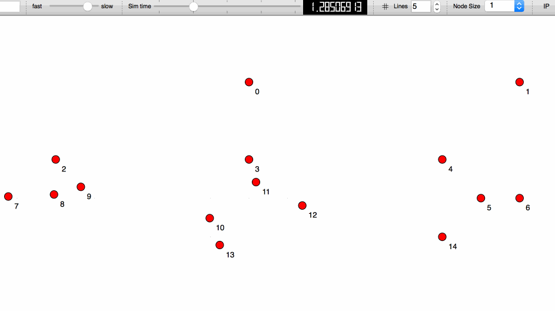
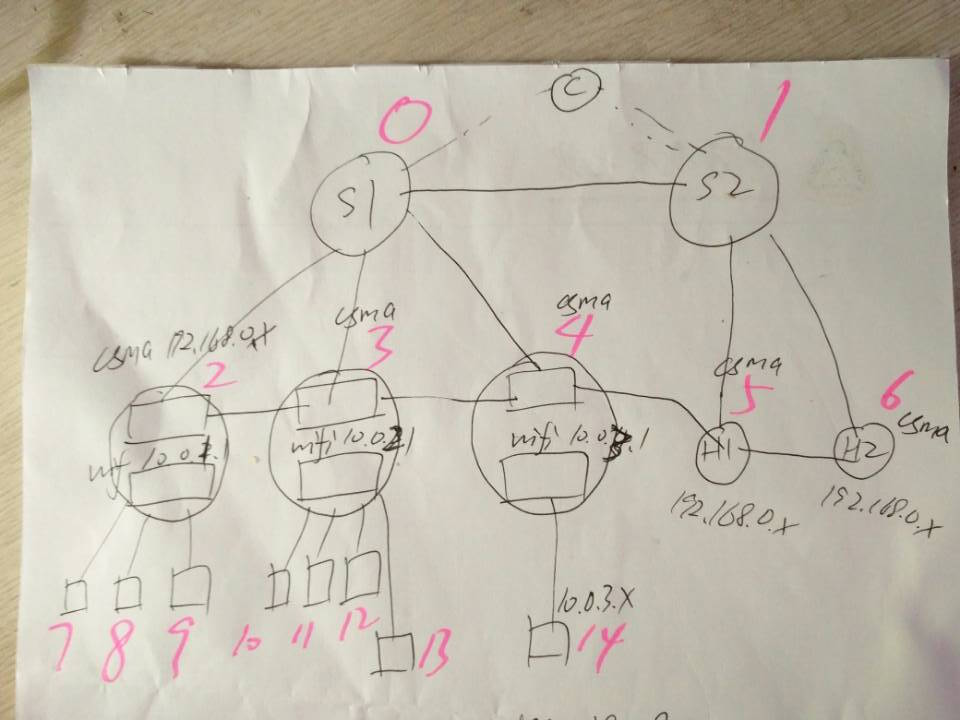

# UDP Echo Experiment using ns-3

## Demo

## Network Topology
Detailed network topology is depicted in the top of the file `goal-topo.cc`. 

### Nodes Description
- node-0<--> switch-1, connecting node-2,3,4(AP1,AP2,AP3) and node-1(switch-2); ***stationary*** ;
- node-1<--> switch-2, connecting node-5,6(terminal-1,terminal-2) and node-0(switch-1); ***stationary*** ;
- node-2,3,4<--> AP1,AP2,AP3; ***stationary*** ;
- node-5,6<--> terminal-1, terminal-2; ***stationary*** ;
- node-7,8,9<--> mobile stations in **AP1**'s wireless network;
- node-10,11,12,13<--> mobile stations in **AP2**'s wireless network;
- node-14<--> mobile station in **AP3**'s wireless network; ***stationary*** ;

**Note:**  
1. node-2,3,4,5,6 are in the same csma network(`192.168.0.0/24`). 
2. node-2,7,8,9 are in the same wirelss network(`10.0.1.0/24`). 
3. node-3,10,11,12,13 are in the same wirelss network(`10.0.2.0/24`). 
4. node-4,14 are in the same wirelss network(`10.0.3.0/24`). 

## UDP Echo Experiment
- Simulation starts at time `0.0`;
- UdpServer(node-6, `192.168.0.8`) starting at time `1.0` stopping at time `5.0`;
- UdpClient(node-14, `10.0.3.2`) starts at time `2.0` stopping at time `5.0`, during which **four** UDP packets are sent from UdpClient; 
- Simulation stops at time `5.0`;

### Process
The 802.11 beacons are present all through the simulation process since the simulation starts, but they are not what we focus on here. We focus on the UDP packets. 
At time `1.0`, the UdpServer starts. Then at time `2.0`, the UdpClient starts. It sends ARP requests to get the destination's physical address before it sends the UDP packet.All in all, finally the UdpClient(at port#49153) has sent the UDP packet to the UdpServer(at port#9), and the UdpServer(at port#49153) has sent the UDP packet back to the UdpClient(at port#9). We could load the `goal-topo.xml` in  `NetAnim` to analyze the detailed process 
More detailed description of this process is made later.
